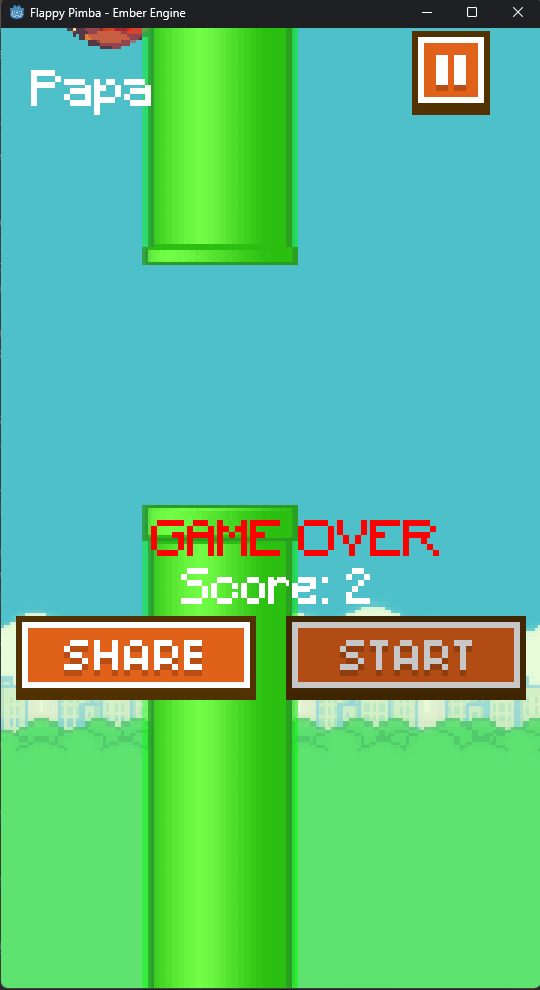

# Flappy bird with Ember Engine

This is the simplest Flappy Bird game made with my `Engine` in order to compile the game you need to have the [Ember Engine](https://github.com/vsaint1/ember_engine/tree/main/engine) source code.

# How to play

- Use the space bar to jump, touch the screen or the left mouse button to jump.

  
  

